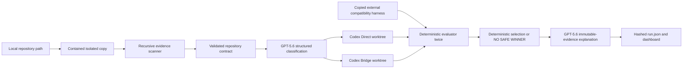

# Architecture

`src/repository.ts` resolves a local source, rejects URLs in P0, validates containment/limits, rejects symlinks, and copies without `.git`, dependencies, build output, coverage, or runs. Source repository is never modified.

`src/config.ts` validates version 1 command arrays, boundaries, primitive/context, dependency policy, timeouts, and limits. `src/scanner.ts` recursively produces supported, discovery-only, and unknown evidence. Ambiguous or unsupported evidence blocks automatic migration.

`src/engine.ts` initializes isolated baseline Git history, copies and hashes compatibility harness outside worktrees, hashes protected paths, builds immutable contract, and starts two Codex SDK threads with identical baseline/contract/policy. Only strategy instruction differs. Candidate network and web search are disabled; approval is `never`.

Parent process runs repository commands, writable-boundary checks, protected hashes, dependency/secret/native-API gates, copied harness integrity, negative crypto checks, and two full evaluator passes. Only all-pass candidates are eligible. Selection order is fewer RSA signatures, fewer changed lines, then smaller envelope. GPT cannot mutate evidence or selection.

Vercel or `QT_RECORDED_MODE=1` bypasses live paths and renders committed sample evidence. Local mode uses authenticated Codex SDK without requiring `OPENAI_API_KEY`.
