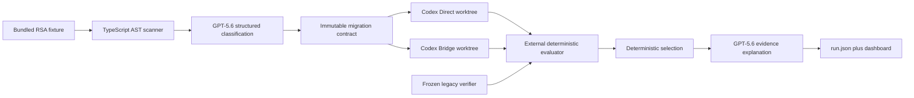

# Architecture

Main repository owns web app, orchestrator, contract, evaluator, and frozen legacy verifier. Every run copies fixture into temporary Git baseline, records its manifest/commit, then creates two worktrees. Codex may write only candidate worktree. Parent invokes evaluator only after turns end. Candidate generation happens once; complete evaluator runs twice against same branch.
