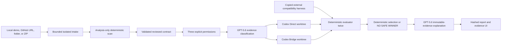

# Architecture

`src/intake.ts` is the trust boundary before the existing engine. It accepts only strict public `https://github.com/{owner}/{repo}` URLs, controlled local copies, explicit browser folder manifests, or bounded ZIP data. Clone/import happens in private ignored `runs/intakes/` storage. Analysis scans files and validates JSON; it never installs dependencies or executes repository commands.

`src/config.ts` validates version-1 command arrays, boundaries, primitive/context, dependency policy, timeouts, and limits. `src/scanner.ts` separates supported, discovery-only, ambiguous, and blocking evidence. Automatic execution requires defensible RSA signing and verification, a valid reviewed contract, and a contained external harness.

`src/engine.ts` receives only a backend-revalidated ready intake. It creates an isolated baseline and two worktrees, normalizes minimum writable permissions only inside the copy, records normalizations, freezes contract/harness hashes, and starts two authenticated Codex SDK threads with identical evidence. Only the Direct-versus-Bridge strategy differs.

The parent process runs declared commands, writable/protected/dependency/secret/native-API gates, negative crypto checks, compatibility, and two full evaluator passes. Only all-pass candidates are eligible. Selection order is fewer RSA signatures, fewer changed lines, then smaller envelope. GPT cannot mutate evidence, eligibility, or selection.

`pnpm app` performs preflight and launches production Next.js on `127.0.0.1`. Vercel or `QT_RECORDED_MODE=1` bypasses every live intake/execution path and serves four strict-allowlist committed reports. Hosted POST endpoints return 403.
