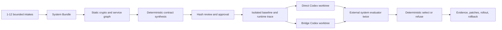

# Architecture

`src/intake.ts` owns bounded intake, two-stage analysis, bundle revalidation, exact contract-hash approval, and the final strict execution boundary. `src/system-bundle.ts` discovers package managers, workspaces, entry points, scripts, loopback health checks, Compose relationships, crypto boundaries, components, and provenance. It synthesizes version-2 contracts outside candidate roots; GPT never approves a field.

`src/runtime-trace.ts` installs a temporary Node preload only during approved workflows. It records operation, algorithm, key type, repository-relative call site, payload byte length, optional context metadata, and component ID. It never records payloads, plaintext, signatures, keys, tokens, or credentials.

`src/system-execution.ts` assembles isolated repository copies, performs frozen install/typecheck/build, starts managed processes, waits only on approved loopback health checks, executes the genuine workflow, collects trace metadata, terminates process trees, and verifies cleanup. Each candidate is evaluated twice from separate Git worktrees.

`src/system-engine.ts` gives Direct and Bridge identical frozen bundle/graph/contract evidence through `@openai/codex-sdk@0.144.6` with exact `gpt-5.6-sol`, network/web disabled, workspace-only writes, and approval `never`. Deterministic gates own path policy, protected files, dependencies, secrets, crypto adapters, frozen negative coverage, complete workflow, trace hygiene, evaluator integrity, repeatability, and selection. GPT/Codex cannot override a failed gate.

`src/system-export.ts` groups the selected diff by repository and creates a downloadable evidence/rollout package. It does not modify originals, create risk acceptance, push, deploy, or submit.

Historical version-1 single-repository execution remains in `src/engine.ts` for the committed Build Week samples and `pnpm demo`. Those reports and release tags are not rewritten. Hosted `/demo` imports samples; `/lab` imports none; all hosted live endpoints return 403.
